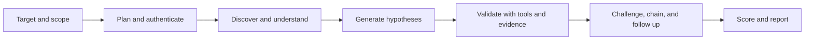

# WebPent

WebPent is a target-agnostic web application security testing framework built with **Python 3.12**, **FastAPI**, **Celery**, **LangGraph**, and **Pydantic**. It combines deterministic discovery and validation tools with bounded LLM-assisted reasoning. The design goal is not to guess vulnerabilities: a reportable Finding requires tool-confirmed or human-reviewed evidence.

> **Current delivery:** v60 remediation adds fail-closed migration handling, PBKDF2 task-key derivation, request-context reporting, access-control rate governance, checkpoint-safe `auto_approve` restoration, optional Anthropic routing for prompt caching, feature-flagged bug-bounty reporting, and a redaction-safe JavaScript intelligence bridge. Verification is complete at **700 tests passing** (including parametrized cases). The project is an active security-testing framework, not a claim that every vulnerability class is automatically confirmed on every target.

## Start here

If you are learning the project, read these files in this order:

1. [`docs/architecture_simple.md`](docs/architecture_simple.md) — the short mental model.
2. [`docs/architecture_detailed.md`](docs/architecture_detailed.md) — the actual LangGraph topology, feature flags, loops, and safety boundaries.
3. [`src/webpent/state/initial_state.py`](src/webpent/state/initial_state.py) — the canonical engagement state.
4. [`src/webpent/graph/builder.py`](src/webpent/graph/builder.py) — node registration and routing.
5. [`scripts/doctor.py`](scripts/doctor.py) — operator diagnostics for LLM and local readiness.
6. [`audit/coverage_matrix_v55_plus.md`](audit/coverage_matrix_v55_plus.md) — category maturity and closure criteria.

## What WebPent does

A normal engagement moves through planning, authentication, reconnaissance, crawling, target understanding, hypothesis generation, deep probes, evidence validation, bounded follow-up, scoring, and reporting. The graph is designed so that discovery signals, hypotheses, evidence, relational links, and confirmed Findings remain separate.

| State concept | Use |
|---|---|
| **Crawled data** | Endpoints, forms, headers, JavaScript references, and other surface facts. |
| **Surface observation** | A passive signal that a vulnerability category may exist. It is never a Finding by itself. |
| **Hypothesis** | A testable idea that may be promoted, abandoned, or left inconclusive. |
| **Canonical evidence** | A normalized request, response, tool result, or human-reviewed artifact. |
| **Relational evidence** | A typed relationship between identities, resources, requests, or findings. It is not automatically a vulnerability. |
| **Finding** | A reportable result that passed evidence and confidence rules. |

## Architecture maps

The two maintained diagrams are the source of truth for understanding the system:

- [Simple architecture](docs/architecture_simple.md)
- [Detailed architecture](docs/architecture_detailed.md)

At a high level:



The actual graph contains optional JavaScript intelligence, target understanding, attack graph, surface-security projection, bounded payload optimization, exploit chaining, and rabbit-hole loops. Those paths are feature-flagged or policy-bounded; see the [detailed graph](docs/architecture_detailed.md).

## Project layout

```text
webpent_review/
├── src/webpent/
│   ├── agents/              LangGraph nodes; one folder per responsibility
│   ├── api/                 FastAPI routes and request/response handling
│   ├── cli/                 CLI entrypoint and operator options
│   ├── config/              Settings and safety policies
│   ├── graph/               Graph construction and conditional routing
│   ├── models/              Typed domain models and evidence contracts
│   ├── shared/              Deterministic utilities, LLM router, redaction, scope
│   ├── state/               PentestState, reducers, and initial-state factory
│   ├── tools/               Tool adapters and lazy registry discovery
│   └── workers/             Celery task entrypoints
├── tests/                   Unit, integration, safety, and contract tests
├── scripts/                 Operator tools such as doctor and local checks
├── audit/                   Coverage, review, baseline, and delivery records
├── docs/                    Human-facing architecture and debugging guides
├── Makefile                 Reproducible local and Docker commands
└── pyproject.toml           Python package metadata and dependencies
```

## Requirements

The deterministic core runs without an LLM API key. For the complete local stack, use Python 3.12, Docker Compose, Redis, and the dependencies declared in `pyproject.toml`. Playwright/Chromium is required only for browser-based workflows. External scanners such as Nuclei, Dalfox, SQLMap, Katana, httpx, and Subfinder are optional integrations; the framework must record unavailable tools clearly rather than pretending that they ran.

An LLM provider is optional. Set `LLM_ENABLED=false` or `WEBPENT_LLM_ENABLED=false` for an explicitly deterministic/offline engagement. Do not put API keys in source files, reports, ZIP archives, or chat messages.

## Installation

```bash
cd /home/ubuntu/webpent_review
python3 -m venv .venv
. .venv/bin/activate
pip install -e .

# Required only for browser workflows
playwright install chromium

# Optional local configuration
cp .env.example .env
```

Generate local secrets rather than copying examples into a real deployment:

```bash
python -c "import secrets; print(secrets.token_hex(32))"
```

Set the generated values in the local environment for `JWT_SECRET_KEY` and `AUDIT_SECRET_KEY`. Keep `.env` outside delivery archives.

## Docker workflow

The Makefile is the preferred interface because it documents the project's intended service names and initialization order.

```bash
make dev-init
make build-base
make build-app
make dev-up
make dev-logs
make close
```

The default **development** stack exposes the API at `http://localhost:8000`. For production, use `docker-compose.yml`, provide strong secrets and `WEBPENT_USERS`, set explicit CORS origins, and provide externally managed `rediss://` URLs through `REDIS_URL` and `RATE_LIMIT_REDIS_URL`. The current persistence layer is SQLite-only; the PostgreSQL profile is retained for compatibility and experimentation, but it is not a supported production backend until a PostgreSQL implementation is added. Do not assume that a passing SQLite run proves PostgreSQL reliability.

Before exposing the API beyond localhost, copy `.env.example` to a private environment file and complete this preflight:

```bash
cp .env.example .env
# Replace every CHANGE-ME value with independently generated secrets.
# Set AUTH_ENABLED=true, explicit CORS_ORIGINS, and production rediss:// URLs.
# Keep ALLOW_INSECURE_TLS=false and do not enable local-only overrides.
make doctor
.venv/bin/python main.py preflight
.venv/bin/pytest -q
```

Do not publish `.env`, SQLite databases, cookies, reports containing credentials, or service logs. Run the API behind a TLS-terminating reverse proxy, restrict the proxy's trusted IP list, use an externally managed Redis with certificate verification, and rotate JWT, audit, Celery-payload, webhook, and OOB secrets independently. The production compose file intentionally does not create an internal Redis service.

## CLI and API

The exact CLI options may evolve with the active entrypoint, so first inspect:

```bash
python main.py --help
python main.py scan --help
```

Typical examples are:

```bash
python main.py scan --url http://127.0.0.1:4280
python main.py scan --url http://127.0.0.1:4280 --auto-approve
python main.py preflight
```

`--auto-approve` removes the graph interrupt before `execution_sandbox`. Use it only for an explicitly authorized local lab or an approved automation pipeline. The default path pauses before potentially active execution.

For the API, authenticate first with a user explicitly configured in `WEBPENT_USERS` (never use `admin:admin` outside an isolated development fixture), then submit a scan through the versioned route:

```bash
curl -X POST http://localhost:8000/token \
  -H 'Content-Type: application/x-www-form-urlencoded' \
  -d 'username=<configured-user>&password=<strong-password>'

curl -X POST http://localhost:8000/api/v1/scans \
  -H 'Authorization: Bearer <TOKEN>' \
  -H 'Content-Type: application/json' \
  -d '{"url":"http://127.0.0.1:4280","auto_approve":false}'
```

Then query the status and Findings using the returned thread identifier:

```bash
curl http://localhost:8000/api/v1/scans/<thread_id>/status \
  -H 'Authorization: Bearer <TOKEN>'

curl http://localhost:8000/api/v1/scans/<thread_id>/findings \
  -H 'Authorization: Bearer <TOKEN>'
```

Credentials, session cookies, scope, and target-specific options are operator inputs. WebPent does not contain a DVWA or WAPTLab cookie downgrade in the authentication node and does not hardcode a target route. Never paste real credentials into source control.

## Configuration that affects reasoning

| Setting | Default | Meaning |
|---|---:|---|
| `LLM_ENABLED` / `WEBPENT_LLM_ENABLED` | enabled unless configured otherwise | Explicitly enables or disables LLM calls. Disabled means deterministic fallback, not a crash. |
| `enable_js_intelligence` | `false` | Collect and review JavaScript intelligence after crawling. |
| `enable_target_understanding` | `false` | Build a structured model of routes, workflows, auth state, and likely business logic. |
| `enable_attack_graph` | `false` | Run the optional attack-graph reasoning node. |
| `enable_surface_security_analysis` | `false` | Write bounded passive observations and coverage gaps. It never confirms a vulnerability. |
| `enable_bug_bounty_reporter` | `false` | Select the Markdown reporter with per-finding sections plus redaction-safe JavaScript and hidden-parameter appendices. |
| `skip_recon` | `false` | Bypass network reconnaissance when the operator already supplied a controlled starting point. |
| `auto_approve` | `false` | Keep the human approval boundary unless the operator explicitly overrides it. |
| `max_surface_security_observations` | `100` | Bounds passive surface output. |
| `preferred_provider` / `anthropic_api_key` | configured | Anthropic is an optional routed provider. When selected and available, the shared router can enable prompt-caching capability detection; missing SDKs or keys remain safe fallback conditions. |

Use `scripts/doctor.py` rather than manually testing provider keys:

```bash
make doctor
# or
python scripts/doctor.py --json
python scripts/doctor.py --timeout 10
```

When LLM is disabled, doctor performs no provider network probes, reports deterministic mode as healthy, and exits successfully. When LLM is enabled, it reports configured providers, active/failing status, fallback state, and circuit-breaker information without printing secrets.

## Where the LLM belongs

The shared router in [`src/webpent/shared/llm.py`](src/webpent/shared/llm.py) is the only provider boundary. It now includes an optional Anthropic builder and routing entries without making the Anthropic SDK mandatory at import time. When Anthropic is selected, the capability layer can recognize prompt-caching support; if the SDK, key, or provider is unavailable, the router records the failure and follows its bounded fallback order. LLM assistance is appropriate for planning, target-understanding synthesis, hypothesis prioritization, payload ideation, business-impact wording, executive summaries, and devil's-advocate review. The following remain deterministic safeguards:

- scope and target authorization;
- URL normalization and redaction;
- feature-flag routing and retry bounds;
- evidence status and confidence promotion;
- relational-edge status;
- destructive-PoC policy and human approval;
- final report eligibility.

An LLM-generated sentence is not evidence. The validator must ground a claim in tool output or a human-reviewed artifact. If the router fails, nodes should use their bounded deterministic fallback and record the degraded path for debugging.

## Debugging runbook

### 1. Establish the local baseline

```bash
cd /home/ubuntu/webpent_review
PYTHONPATH=src pytest -q
python -m compileall -q src
make doctor
```

A failure in baseline tests is a code/regression issue. A provider warning while `LLM_ENABLED=false` is not a failure; offline mode is intentionally deterministic.

### 2. Identify the first divergence

Inspect the run's thread/checkpoint state and ask which bucket stopped changing: `crawled_data`, `hypotheses`, `findings`, `canonical_observations`, `canonical_executions`, `surface_security`, `relational_evidence`, or the debug/routing fields. Do not start by editing the reporter; a missing Finding usually originates in discovery, routing, evidence, or approval.

### 3. Check routing and flags

Open [`src/webpent/graph/builder.py`](src/webpent/graph/builder.py). Confirm that the node is registered, the conditional route can return its name, and the relevant flag is enabled. `skip_recon` intentionally changes the first discovery path. JavaScript intelligence, target understanding, attack graph, and surface-security are additive paths and default off.

### 4. Check the evidence boundary

For a pending result, inspect `validator`, `execution_sandbox`, and `devils_advocate`. Confirm the candidate has a valid payload/request mapping, a tool result or human review, an approval state when required, and a retry counter below the configured bound. A surface observation, hypothesis, or relational edge must not be promoted automatically.

### 5. Check LLM behavior

Run:

```bash
python scripts/doctor.py --json
```

Then inspect `get_llm_diagnostics()` output in a local debug session. It is intentionally redaction-safe and reports enabled state, configured provider names, fallback mode, dead-provider state, and task routing—not keys or prompts containing secrets.

### 6. Check JavaScript and report wiring

When both `enable_js_intelligence` and `enable_surface_security_analysis` are enabled, the JavaScript node performs a second bounded passive surface projection after static review. This is necessary because the crawler runs before JavaScript intelligence in the graph. Routes and sinks become surface observations with explicit validation requirements; they do not become Findings. Secret candidates are stored only as redacted values, hashes, source references, and evidence identifiers. The same redaction-safe projection is bridged into `crawled_data.js_secrets`, which is consumed by the optional bug-bounty appendix.

### 7. Check tool discovery

Tool discovery is lazy and idempotent. Importing `webpent.tools` should not execute discovery as an import side effect. The registry performs discovery when a lookup or explicit `ensure_discovered()` call needs it. Use registry diagnostics to distinguish an unavailable external binary from a broken wrapper.

## Testing

Run the complete suite:

```bash
cd /home/ubuntu/webpent_review
PYTHONPATH=src pytest -q
```

Run focused contracts while developing:

```bash
PYTHONPATH=src pytest -q tests/test_v57_readability_wiring.py
PYTHONPATH=src pytest -q tests/test_v29_surface_security.py tests/test_v30_evidence_poc_contracts.py
ruff check src/webpent
python -m compileall -q src
```

Tests should prove behavior, not merely imports. Important contracts include state-factory parity between CLI and Celery, offline LLM fallback, redaction, lazy registry discovery, surface-observation non-promotion, relational-evidence stability, PoC approval boundaries, and bounded graph loops.

## Security and operational boundaries

Only scan assets for which you have explicit authorization. Scope enforcement applies to discovered URLs and follow-up candidates. Destructive or high-risk proof-of-concept actions require human approval; `auto_approve` is an explicit operator decision, not an LLM decision. Do not use production credentials in a lab, do not archive cookies or databases, and do not run unrestricted RCE, SQL dumps, credential attacks, or data exfiltration.

The project records uncertainty explicitly. `Not Scanned`, `Inconclusive`, `Needs Human Review`, and `Tool Confirmed` are different states. A category being listed in a coverage enum, a surface observation, or a hypothesis does not mean that the target contains the vulnerability.

## Current coverage position

WebPent has category-specific validators and discovery contracts across the requested OWASP-oriented surface, but maturity differs by category and target. Some classes have deterministic structural or tool-assisted paths; others remain passive, heuristic, or require an active validator and human review. Use [`audit/coverage_matrix_v55_plus.md`](audit/coverage_matrix_v55_plus.md) and [`audit/v56_coverage_report.md`](audit/v56_coverage_report.md) instead of inferring coverage from a list of enum values.

The framework is target-agnostic: it does not promise a fixed vulnerability count, does not treat DVWA/WAPTLab routes as universal, and does not convert a lab-specific observation into a general claim.

## Change records

- [`DELIVERY_NOTES_V56.md`](DELIVERY_NOTES_V56.md) — prior delivery and safety contracts.
- [`DELIVERY_NOTES_V58.md`](DELIVERY_NOTES_V58.md) — POST-form, evidence-gate, and loop-convergence delivery.
- [`DELIVERY_NOTES_V59.md`](DELIVERY_NOTES_V59.md) — P0 hardening, Anthropic routing, reporter selection, and JS wiring verification.
- [`audit/v56_coverage_report.md`](audit/v56_coverage_report.md) — previous coverage classification.
- [`audit/plan_v57_readability_wiring_cleanup.md`](audit/plan_v57_readability_wiring_cleanup.md) — v57 implementation plan.
- [`audit/v57_dead_code_review.md`](audit/v57_dead_code_review.md) — dead-code and dynamic-entrypoint review.
- [`audit/v57_baseline_smoke.py`](audit/v57_baseline_smoke.py) — reproducible baseline smoke helper.

## License

This project is licensed under the MIT License. Use it only for authorized security testing and defensive research.
