# WebPent

**Current release candidate:** `0.3.0` — tested on Python `3.12.3`; resolved LangGraph `1.2.11` and `langgraph-checkpoint-sqlite` `3.1.1`. The canonical identity and qualification boundary are maintained in [`docs/CURRENT_RELEASE.md`](docs/CURRENT_RELEASE.md). The latest metadata/audit revision is `c685909`; historical v55/v56/v57/v58/v59/v61/v95 documents remain historical evidence and do not redefine this release.

WebPent هو إطار عمل لاختبار اختراق تطبيقات الويب مبني على Python وFastAPI وCelery وLangGraph وPydantic. يجمع بين الاكتشاف الحتمي، إدارة الفرضيات، التحقق القابل لإعادة التشغيل، الذاكرة وRAG، والتحليل الاختياري بالـLLM، مع فصل واضح بين الملاحظة والفرضية والدليل والـFinding.

> **الحالة الحالية:** نسخة **Evidence-Aware Bounded Autonomous Bug Hunter** مع تكامل `bbscout Target Package v2`. التكامل موصول ومختبر offline عبر CLI وFastAPI/Celery first-run وresume، بالإضافة إلى Target Brain وKnowledge/Attack Graph وbounded research planning وspecialized researcher contracts وmemory/LLM boundaries وadmission وengagement binding وscope/action authorization وcapability preflight وvalidator continuity وProofBundle والتقارير. المشروع **ليس VIP Smart Autonomous Bug Hunter مؤهلًا رسميًا بعد**؛ راجع قسم القيود قبل أي تشغيل حي.

> **تنبيه قانوني:** استخدم WebPent فقط على أنظمة تملكها أو لديك تصريح كتابي لاختبارها. لا تستخدمه ضد أهداف عامة أو أنظمة طرف ثالث دون تفويض صريح.

## الحكم الحالي والنتائج الموثقة

الحكم الهندسي الحالي هو **Evidence-Aware Bounded Autonomous Bug Hunter**، وليس ادعاءً بتغطية شاملة أو تأهل VIP. آخر مراجعة للطلبات والتنفيذ موثقة في [`docs/RECENT_THREE_REQUESTS_AUDIT.md`](docs/RECENT_THREE_REQUESTS_AUDIT.md)، وسجل المراحل في [`docs/VIP_INTEGRATED_EXECUTION_STATUS.md`](docs/VIP_INTEGRATED_EXECUTION_STATUS.md).

الـGit source revision والأدلة المرتبطة به مثبتة في `docs/release_manifest.json` وملفات التتبع داخل هذه النسخة؛ الهوية الحالية نفسها موثقة في [`docs/CURRENT_RELEASE.md`](docs/CURRENT_RELEASE.md). آخر metadata/audit commit مدفوع هو `c685909`، ولا يُخلط ذلك مع implementation source revision المسجل في canonical release identity.

| البوابة | النتيجة |
|---|---|
| bbscout full pytest | 36 passed |
| WebPent full regression | 1512 passed، 56 warnings |
| Phase 11 qualification/target/graph/research/autonomy/benchmark contracts | 140 passed |
| Release/plan-artifact audit suite | 43 passed |
| G-02 inventory/runtime/precommit gate | Passed؛ 283 direct-I/O records |
| Ruff | Passed |
| compileall | Passed |
| `git diff --check` | Passed |
| tracked-secret scan | Passed؛ لا high-confidence secrets في source/config المتتبع |
| Offline release verifier | Passed؛ لا target contact؛ signature operator key optional |

هذه النتائج تثبت العقود والـregressions التي تم اختبارها محليًا، لكنها لا تثبت اكتشاف كل الثغرات على كل هدف، ولا تثبت qualification حيًا أو موزعًا. Adapters الـproviders الأربعة في هذه النسخة تعمل عبر fixtures محلية Offline فقط؛ لا يُدّعى live compatibility أو live smoke لـBugcrowd أو Intigriti أو YesWeHack، وHackerOne live adapter ليس مشغّلًا في هذه الجولة.

## ما هو Target Package v2؟

`Target Package v2` هو عقد intake يصف البرنامج والهدف والنطاق والسياسة والقدرات ومصدر البيانات. الحزمة **تصف القيود ولا تمنح صلاحيات إضافية**. لا يمكن للحزمة أن توسع target scope أو تتجاوز `ActionAuthority` أو شروط الإثبات.

تمر الحزمة التنفيذية بالمسار التالي:

```mermaid
flowchart LR
    source[bbscout package] --> digest[Canonical digest check]
    digest --> signature[Detached Ed25519 verification]
    signature --> confirm[Explicit confirmation]
    confirm --> lease[One-time engagement lease]
    lease --> scope[ScopeCompiler and policy decision]
    scope --> capability[Capability preflight]
    capability --> authority[Central ActionAuthority]
    authority --> proof[Verifier and ProofBundle]
    proof --> report[Redacted report continuity]
```



### قواعد admission والتنفيذ

يتم إعادة حساب `content_sha256` للتمثيل canonical داخل WebPent، بينما يبقى `source_response_sha256` دليلًا مستقلًا لمصدر الحزمة. لا يتم مقارنة hash المصدر مع hash محتوى الحزمة لأنهما يمثلان شيئَين مختلفين.

التنفيذ package-backed يتطلب detached Ed25519 signature بحالة `verified`، ومفتاحًا عامًا موثوقًا يمرره المستدعي وقت التشغيل. الحالة `unsigned-local-mvp` صالحة للمراجعة المحلية فقط، وليست صالحة لإنشاء engagement تنفيذي.

`EngagementFactory` ينشئ binding أحادي الاستهلاك في SQLite صغير لا يحفظ raw package أو secrets. يتم رفض confirmation الناقصة، ومخالفة package ID أو digest، والهدف الخارج عن النطاق، وانتهاء الحزمة أو إلغائها، وإعادة استهلاك الحزمة أو engagement ID.

### تشغيل الحزمة عبر نقاط التشغيل الفعلية

في CLI يمكن تشغيل الحزمة الموقعة باستخدام `--target-package` و`--target-package-confirmation` و`--target-package-trust-map`. يقرأ CLI الملفات transiently، ويتحقق من Ed25519 عبر public-key map يقدمه المشغّل وقت التشغيل، ثم ينشئ lease قبل دخول graph؛ لا يُحفظ raw package أو trust material في checkpoint.

في API تُرسل الحقول نفسها داخل `ScanRequest` بحدود حجم ونوع، وتُجرى validation أولية قبل dispatch. العامل يعيد التحقق من التوقيع والـscope والـconfirmation قبل أول graph node، ولا يعتمد على `signature_state` المرسل أو على تحقق API وحده. عند redelivery/resume يستعيد binding redacted ويتحقق من lease continuity دون استهلاك lease ثانية. الطلبات القديمة بلا Target Package تستمر في legacy flow وفق سياساتها الحالية.

يستخدم `ScopeCompiler` قواعد normalized scope مرة واحدة داخل WebPent، ويفحص scheme وhost وport وpath وwildcard وexclusion وmethod وaction class وredirect chain. القرارات typed وتشمل `allow` و`allow_with_constraints` و`deny_out_of_scope` و`deny_policy` و`deny_expired` و`deny_revoked` و`deny_ambiguous`.

### استمرارية الإثبات والتقرير

أي confirmation قابلة للتقرير يجب أن تعتمد على **causal signal** و**neutral negative control** وProofBundle مختوم وقابل لإعادة التشغيل. candidate أو heuristic أو mock أو timeout أو 403/429 أو missing capability لا يتحول إلى confirmed أو clean.

تنتقل package identity والـdigests من action metadata إلى verifier ثم ProofBundle ثم التقرير. التقرير يحتوي على `target_package_continuity` redacted ويدخل هذا الجزء في audit/master hash. لا يتم وضع private keys أو provider credentials أو cookies أو OTPs داخل state أو checkpoint أو prompt أو report أو archive.

## ابدأ من هنا

للتعرف على النظام، ابدأ بالملفات التالية:

1. [`docs/architecture_simple.md`](docs/architecture_simple.md) — النموذج الذهني المختصر.
2. [`docs/architecture_detailed.md`](docs/architecture_detailed.md) — topology الـLangGraph وحدود الأمان.
3. [`src/webpent/state/initial_state.py`](src/webpent/state/initial_state.py) — bootstrap والحالة canonical.
4. [`src/webpent/graph/builder.py`](src/webpent/graph/builder.py) — العقد ومسارات التوجيه وpackage preflight.
5. [`src/webpent/shared/action_authority.py`](src/webpent/shared/action_authority.py) — بوابة التنفيذ المركزية.
6. [`src/webpent/shared/target_package_context.py`](src/webpent/shared/target_package_context.py) — admission وredaction-safe projection.
7. [`src/webpent/shared/engagement_factory.py`](src/webpent/shared/engagement_factory.py) — confirmation وone-time lease.
8. [`src/webpent/shared/package_scope.py`](src/webpent/shared/package_scope.py) — canonical scope/policy compiler.
9. [`src/webpent/shared/package_preflight.py`](src/webpent/shared/package_preflight.py) — package/capability preflight.
10. [`src/webpent/models/proof_bundle.py`](src/webpent/models/proof_bundle.py) و[`src/webpent/shared/verifier.py`](src/webpent/shared/verifier.py) — قواعد الإثبات وإعادة التشغيل.
11. [`src/webpent/reporter/export.py`](src/webpent/reporter/export.py) — التقرير وaudit hash.
12. [`docs/integration/integration_manifest.md`](docs/integration/integration_manifest.md) — mapping المتطلبات إلى التنفيذ والاختبارات.
13. [`docs/integration/final_audit.md`](docs/integration/final_audit.md) — الحكم النهائي والقيود.

## المكونات الأساسية

| المكوّن | وظيفته |
|---|---|
| LangGraph workflow | التخطيط والاكتشاف وفهم الهدف وتوليد الفرضيات والتنفيذ والتحقق والتقرير. |
| ActionAuthority | نقطة التحكم المركزية لكل action؛ لا يوجد transport خفي يتجاوزها. |
| Validators | فحوص structural وcausal وreplay مع حالات confirmed وcandidate وinconclusive وblocked. |
| ProofBundle | ختم proof قابل للتحقق، يتضمن continuity الخاصة بالحزمة عندما يكون engagement package-backed. |
| Knowledge Pack/RAG | منهجيات وتقارير وwrite-ups وauthorized scenarios ضمن trust boundary؛ محتوى RAG بيانات وليس تعليمات تنفيذ. |
| Memory isolation | عزل lessons حسب `client_id` و`engagement_id` عند الحاجة. |
| Smart campaigns | تخطيط bounded وإعادة تخطيط عند المعرفة الناقصة دون تحويل الفشل إلى clean. |
| Reporter | إخراج redacted متعدد الصيغ مع audit trail وpackage continuity. |
| Celery/Redis | مسار worker موجود، لكن qualification الموزعة الكاملة تحتاج بيئة staging قابلة لإعادة الإنتاج. |

## هيكل المشروع

```text
.
├── src/webpent/
│   ├── agents/              # عقد LangGraph والـvalidators
│   ├── api/                 # FastAPI routes
│   ├── cli/                 # CLI وعمليات الإدخال
│   ├── config/              # الإعدادات وسياسات الأمان
│   ├── graph/               # بناء الرسم ومسارات التوجيه
│   ├── memory/              # Chroma وlessons وretrieval
│   ├── models/              # النماذج وعقود الأدلة
│   ├── shared/              # authority وscope وproof وLLM helpers
│   ├── state/               # PentestState وreducers
│   ├── tools/               # adapters واكتشاف الأدوات
│   └── workers/             # Celery task entrypoints
├── tests/                   # unit وintegration وsafety وregression
├── scripts/                 # doctor وG-02 وingestion وverification
├── knowledge_pack/          # corpus المحلي المنظم للـRAG
├── docs/                    # architecture وaudit وrelease records
├── Makefile
└── pyproject.toml
```

يتم تسليم bbscout وschemas المشتركة في archive التكامل بجانب WebPent:

```text
bbscout/src/bbscout/
contracts/target-package.schema.v2.json
contracts/capability-profile.schema.v1.json
```

## المتطلبات والتثبيت

- Python 3.12.
- Redis وDocker Compose فقط لمسارات Celery/stack الكامل.
- Playwright/Chromium لمسارات browser-based فقط.
- `cryptography` مطلوب لمسار Ed25519 في bbscout.
- LLM provider وembedding model اختياريان.

من جذر مشروع WebPent:

```bash
python3 -m venv .venv
. .venv/bin/activate
python -m pip install --upgrade pip
pip install -e .
playwright install chromium  # لمسارات المتصفح فقط
```

للتشغيل الحتمي بدون LLM:

```bash
export LLM_ENABLED=false
export WEBPENT_LLM_ENABLED=false
```

أنشئ secrets محلية قوية وقت التشغيل فقط، ولا تضع `.env` أو المفاتيح في Git أو التقارير أو archive:

```bash
python -c "import secrets; print(secrets.token_hex(32))"
```

استخدم القيم الناتجة مع `JWT_SECRET_KEY` و`AUDIT_SECRET_KEY` و`CELERY_PAYLOAD_KEY` حسب مسار التشغيل. لا تضع API keys أو cookies أو credentials داخل source أو prompts أو checkpoints.

## تشغيل WebPent

تحقق من options الفعلية في النسخة التي تشغلها:

```bash
python main.py --help
python main.py scan --help
python main.py status --profile smart-observe
python main.py preflight
```

مثال local lab مصرح به:

```bash
python main.py scan \
  --url http://127.0.0.1:4280 \
  --profile smart-observe
```

`--profile` يحدد composition والسياسة الفعلية للحملة. `--auto-approve` لا يجب استخدامه إلا على lab مصرح به وبعد مراجعة الـscope والـpolicy. الوضع الافتراضي يحافظ على Human-in-the-Loop قبل العمليات النشطة أو الحساسة.

مسار API يتطلب authentication مضبوطًا صراحةً:

```bash
curl -X POST http://localhost:8000/token \
  -H 'Content-Type: application/x-www-form-urlencoded' \
  -d 'username=<configured-user>&password=<strong-password>'

curl -X POST http://localhost:8000/api/v1/scans \
  -H 'Authorization: Bearer <TOKEN>' \
  -H 'Content-Type: application/json' \
  -d '{"url":"http://127.0.0.1:4280","auto_approve":false}'
```

## استخدام package موقعة من bbscout

التوقيع detached يتم بالمفتاح الخاص الذي يمرره المستدعي في الذاكرة فقط. المثال التالي توضيحي ويجب ألا يحوي private key ثابتًا أو حقيقيًا داخل source:

```python
from cryptography.hazmat.primitives.asymmetric.ed25519 import Ed25519PrivateKey
from bbscout.signatures import sign_target_package, verify_detached_signature
from webpent.shared.engagement_factory import EngagementFactory

private_key = Ed25519PrivateKey.generate()  # مثال offline فقط؛ لا تخزن المفتاح
public_key = private_key.public_key()
signed_package = sign_target_package(
    package,
    private_key=private_key,
    key_id="runtime-fixture-key",
)

factory = EngagementFactory(
    "/tmp/webpent-engagement-leases.sqlite",
    signature_verifier=lambda value: verify_detached_signature(
        value,
        trusted_public_keys={"runtime-fixture-key": public_key},
    ),
)
binding = factory.create_from_package(
    signed_package,
    {
        "user_confirmed": True,
        "package_id": signed_package["package_id"],
        "package_sha256": signed_package["integrity"]["content_sha256"],
        "engagement_id": "local-lab-engagement",
        "target_url": "http://example.test/app",
    },
)
```

في بيئة حقيقية يجب أن يأتي trusted public-key map من configuration آمنة ومراجعة. لا يكفي تغيير `signature_state` يدويًا إلى `verified`؛ WebPent يعيد حساب digest ويتحقق من التوقيع فعليًا.

## Scope وcapability preflight

قبل التخطيط والتنفيذ، يفحص package preflight حالة الحزمة والتوقيع والانتهاء والإلغاء وnormalized scope، ثم يقطع متطلبات capability مع local manifest. الحالات غير المتاحة أو المحجوبة بالسياسة أو غير المؤهلة تتحول إلى knowledge gaps وblocked/inconclusive tasks، ولا تتحول إلى clean.

غياب Target Package يبقي legacy flow متاحًا وفق سياساته القديمة، لكن أي package-backed engagement يجب أن يمر بكل بوابات admission وlease وscope وauthority. لا يمكن استخدام package لتجاوز origin policy أو G-02 أو confirmation أو proof requirements.

## التقارير وLLM وRAG

يدعم WebPent مسارات التقارير الحالية مثل JSON وHTML وMarkdown وPDF عندما تكون مفعلة في النسخة المستخدمة. التقرير redaction-safe ويشمل package continuity والـaudit hash عند وجود package. لا يتم auto-submit لأي provider report؛ discovery والقراءة فقط ما لم توجد عملية مصرح بها ومنفصلة مع confirmation صريحة.

الـLLM اختياري ومحصور في أدوار مثل التلخيص أو ترتيب الفرضيات أو تحسين payloads ضمن policy. مخرجات LLM لا تعتبر evidence ولا confirmation. عند غياب API key أو تجاوز rate limit أو فشل provider، يجب أن يعود النظام إلى deterministic fallback أو يسجل knowledge gap؛ لا يجوز تحويل الخطأ إلى clean.

بيانات RAG والمصادر الخارجية تعامل كبيانات غير موثوقة داخل trust boundary. لا تُنفذ تعليمات موجودة داخل write-up أو repository أو صفحة خارجية لمجرد أنها ظهرت في المحتوى.

## الاختبارات وبوابات الإصدار

من archive التكامل، حيث مجلدا `bbscout` و`webpent` متجاوران:

```bash
cd bbscout
PYTHONPATH=src python -m pytest -q

cd ../webpent
PYTHONPATH=../bbscout/src:src python -m pytest tests/ -q --tb=short
ruff check src tests scripts
python -m compileall -q src scripts tests
PYTHONPATH=../bbscout/src:src python -m pytest \
  tests/test_g02_adversarial_indirection.py \
  tests/test_g02_direct_io_inventory.py \
  tests/test_g02_execution_plane.py \
  tests/test_g02_precommit_enforcement.py \
  tests/test_g02_runtime_invariants.py \
  tests/test_g02_scanner_expansion.py -q

python scripts/verify_release_artifacts.py \
  --repo . \
  --manifest docs/release_manifest.json
```

شغّل `make doctor` و`preflight` قبل stack الكامل. نجاح الاختبارات المحلية لا يثبت أن Docker أو Redis أو Celery أو checkpoint resume مؤهل إنتاجيًا؛ اختبارات worker الحالية تستخدم graph/storage mocks ولا تمثل multi-worker أو broker qualification. يجب حفظ logs خارج archive وعدم إدخال SQLite أو cookies أو credentials في release.

## Docker وCelery وproduction

يوجد مسار Docker/Compose وCelery، لكن qualification الموزعة الكاملة تحتاج staging حقيقيًا يثبت image smoke test وworker/Redis/checkpoint-resume وbackup/restore والتعامل مع outages. لا تعتبر حالة `READY_WITH_WARNING` أو نجاح SQLite المحلي دليلًا على production qualification. طبقة persistence الفعلية في هذا التكامل SQLite؛ وجود profile آخر لا يعني أن backend آخر مدعوم إنتاجيًا.

قبل أي تعريض خارج localhost، استخدم secrets قوية وCORS origins صريحة وTLS، واضبط `ALLOW_INSECURE_TLS=false`. لا تنشر `.env` أو قواعد SQLite أو service logs أو تقارير تحتوي على credentials.

## القيود والميزات غير المؤهلة

| البند | الحالة |
|---|---|
| Target Package v2 admission/signature/lease/scope/proof continuity | منفذ ومختبر offline |
| G-02 direct-I/O inventory | regenerated وruntime-checked؛ لا target contact في التحقق الأخير |
| Provider adapters | HackerOne live adapter موجود كـGET-only؛ HackerOne/Bugcrowd/Intigriti/YesWeHack لديهم offline fixtures؛ Bugcrowd/Intigriti/YesWeHack **ليس لديهم live support** |
| WAPTLab وJuice Shop live qualification | **لم تُعاد في هذه الجولة**؛ offline three-run simulation لا تثبت live qualification، وآخر WAPTLab smoke تاريخي ظل `NOT_QUALIFIED` |
| Docker/Celery distributed qualification | **غير مثبتة** |
| Formal VIP thresholds، مثل precision/reproducibility وثلاث جولات مستقلة | **غير مستوفاة** |
| Auto-submit provider reports | غير مسموح به في هذا المسار |

لذلك قرار promotion الحالي هو **NO** حتى تُجمع الأدلة المطلوبة في بيئة مصرح بها وتُراجع النتائج بصورة مستقلة.

## ملفات التوثيق والتسليم

- [`docs/VIP_INTEGRATED_EXECUTION_STATUS.md`](docs/VIP_INTEGRATED_EXECUTION_STATUS.md) — سجل تنفيذ مراحل الخطة التكاملية وحدود qualification.
- [`docs/RECENT_THREE_REQUESTS_AUDIT.md`](docs/RECENT_THREE_REQUESTS_AUDIT.md) — مراجعة آخر ثلاثة طلبات والتحقق من عدم حذف ملفات tracked.
- [`docs/release_manifest.json`](docs/release_manifest.json) — manifest وبصمات source-only release.
- [`docs/V75_MATURITY_SCORECARD.md`](docs/V75_MATURITY_SCORECARD.md) و[`docs/v75_maturity_scorecard.json`](docs/v75_maturity_scorecard.json) — scorecard هندسي لا يساوي VIP qualification.
- [`benchmarks/vip_v1/manifest.json`](benchmarks/vip_v1/manifest.json) — metric contract، proof gates، human-review input، وcost denominator.
- [`docs/WAPTLAB_QUALIFICATION_STATUS.md`](docs/WAPTLAB_QUALIFICATION_STATUS.md) — الحالة الحالية ونتيجة offline proof/replay simulation وحدود live qualification.
- [`docs/PHASE10_PRODUCTION_ARCHITECTURE_ASSESSMENT.md`](docs/PHASE10_PRODUCTION_ARCHITECTURE_ASSESSMENT.md) — assessment صادق لحدود single-node والإنتاج الموزع.
- [`docs/integration/integration_manifest.md`](docs/integration/integration_manifest.md) — mapping المتطلبات إلى التنفيذ والاختبارات.
- [`docs/integration/final_audit.md`](docs/integration/final_audit.md) — final audit وحدود الادعاء.

Source-only archives وملفات SHA-256 الناتجة من release process تُحفظ خارج Git، ويجب توليدها من HEAD المطلوب والتحقق منها بالـmanifest والـoffline verifier قبل التسليم.

> **الخلاصة:** WebPent الآن يملك intake package محكومًا، authorization مركزيًا، scope compiler target-agnostic، capability gaps منظمة، وسلسلة proof/report continuity قابلة للتدقيق. لكنه لا يملك بعد دليلًا صادقًا يسمح بإعلان VIP أو تغطية شاملة لكل نوع من الثغرات أو كل provider/target.
