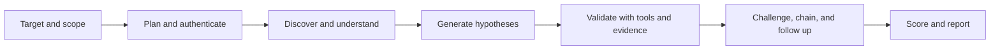

# WebPent

WebPent هو إطار عمل لاختبار اختراق تطبيقات الويب مبني على **Python 3.12** و**FastAPI** و**Celery** و**LangGraph** و**Pydantic**. يجمع المشروع بين الاكتشاف والتحقق الحتميَّين، والتحليل المساعد بالـLLM ضمن حدود واضحة، والذاكرة، والاستدعاء المعزز بالمعرفة (RAG)، وإنتاج التقارير.

الهدف التصميمي ليس تخمين الثغرات؛ فالـ**Finding القابل للتقرير** يجب أن يستند إلى evidence مؤكدة بواسطة أداة أو artifact راجعه إنسان، مع الحفاظ على causal signal وnegative control متى كان ذلك مطلوبًا.

> **الحالة الحالية:** نسخة v60 Smart Hunter مع إصلاحات remediation v61 وKnowledge Pack للـRAG. آخر بوابة تحقق موثقة: **764 اختبارًا ناجحًا**، و`compileall` ناجح، وRuff على `src` و`tests` ناجح. هذه النتيجة تثبت العقود والـregressions المعروفة، ولا تمثل ضمانًا لاكتشاف كل الثغرات على كل هدف.

> **تنبيه قانوني:** استخدم WebPent فقط على أنظمة تملكها أو لديك تصريح كتابي لاختبارها. لا تستخدمه ضد أهداف عامة أو أنظمة طرف ثالث دون تفويض صريح.

## ابدأ من هنا

للتعرف على المشروع، اقرأ الملفات بالترتيب التالي:

1. [`docs/architecture_simple.md`](docs/architecture_simple.md) — النموذج الذهني المختصر.
2. [`docs/architecture_detailed.md`](docs/architecture_detailed.md) — topology الـLangGraph والـfeature flags وحدود الأمان.
3. [`src/webpent/state/initial_state.py`](src/webpent/state/initial_state.py) — الحالة الأساسية للحملة.
4. [`src/webpent/graph/builder.py`](src/webpent/graph/builder.py) — تسجيل العقد ومسارات التوجيه.
5. [`src/webpent/shared/knowledge_retrieval.py`](src/webpent/shared/knowledge_retrieval.py) — helper استدعاء الـRAG bounded.
6. [`scripts/ingest_payloads.py`](scripts/ingest_payloads.py) — مسار الإدخال المعتمد للـknowledge pack.
7. [`scripts/verify_rag_knowledge_pack.py`](scripts/verify_rag_knowledge_pack.py) — إثبات direct retrieval للأنواع الخمسة.
8. [`DELIVERY_NOTES_V61.md`](DELIVERY_NOTES_V61.md) — سجل التنفيذ والبوابات والـGit history.

## ماذا يفعل WebPent؟

تمر الحملة عادةً بالتخطيط، والمصادقة، والاستطلاع، والزحف، وفهم الهدف، وتوليد الفرضيات، والـprobes، والتحقق من الأدلة، والمتابعة المحدودة، والتقييم، والتقرير. يفصل التصميم بين بيانات السطح والفرضيات والأدلة والعلاقات والـFindings المؤكدة.

| مفهوم الحالة | الاستخدام |
|---|---|
| **Crawled data** | Endpoints وforms وheaders ومراجع JavaScript وحقائق السطح الأخرى. |
| **Surface observation** | إشارة سلبية إلى احتمال وجود فئة ثغرات؛ لا تُعد Finding وحدها. |
| **Hypothesis** | فكرة قابلة للاختبار قد تُرقّى أو تُرفض أو تظل inconclusive. |
| **Canonical evidence** | Request أو response أو tool result أو artifact راجعه إنسان بعد توحيده. |
| **Relational evidence** | علاقة typed بين identities أو resources أو requests أو findings؛ لا تعني ثغرة تلقائيًا. |
| **Finding** | نتيجة اجتازت قواعد evidence وconfidence والـvalidation. |



يحتوي الرسم الفعلي على مسارات اختيارية لـJavaScript intelligence وtarget understanding وattack graph وsurface-security projection وbounded payload optimization وexploit chaining وrabbit-hole loops. هذه المسارات feature-flagged أو policy-bounded؛ راجع [الرسم التفصيلي](docs/architecture_detailed.md).

## القدرات الرئيسية

| المجال | الوضع الحالي |
|---|---|
| Workflow orchestration | Graph متعدد المراحل للتخطيط والاكتشاف والفرضيات والتنفيذ والتحقق والتأمل والتقرير. |
| BAC وAuthorization | Authorization matrix، role-aware severity، candidate expansion من query/body/header/GraphQL، وbounded adjacent-ID enumeration. |
| جودة الإثبات | عدم ترقية heuristic أو write-up إلى Finding بدون behavior فعلي وevidence وشروط التحقق المطلوبة. |
| Self-critique | Checkpoints عند فشل validation مع إبقاء النتيجة inconclusive بدل الترقية القسرية. |
| RAG | Knowledge Pack محلي للـmethodologies والـrepositories والـreports والـwrite-ups والـauthorized scenarios. |
| LLM safety | محتوى RAG والبيانات الخارجية داخل trust boundary ولا يُعامل كتعليمات تنفيذ. |
| Memory isolation | عزل lessons حسب `client_id` مع تضييق اختياري حسب `engagement_id`. |
| Reporting | JSON وHTML وتقرير قابل للتوسعة مع authorization matrix appendix وredaction. |
| Resumability | Checkpoints وthread state لاستكمال الحملات المنظمة بدل عرض آخر thread فقط. |

## هيكل المشروع

```text
.
├── src/webpent/
│   ├── agents/              # عقد LangGraph؛ مجلد لكل مسؤولية
│   ├── api/                 # FastAPI routes وscan handling
│   ├── cli/                 # CLI وعمليات الإدخال
│   ├── config/              # الإعدادات وسياسات الأمان
│   ├── graph/               # بناء الرسم ومسارات التوجيه
│   ├── memory/              # Chroma وlessons وembeddings وretrieval
│   ├── models/              # النماذج وعقود الأدلة
│   ├── shared/              # confidence وsafety وauthorization وLLM helpers
│   ├── state/               # PentestState وreducers
│   ├── tools/               # adapters واكتشاف الأدوات
│   └── workers/             # Celery task entrypoints
├── knowledge_pack/          # corpus المحلي المنظم للـRAG
├── tests/                   # unit وintegration وsafety وregression
├── scripts/                 # doctor وingestion وverification
├── audit/                   # coverage وreview وdelivery records
├── docs/                    # architecture وdebugging guides
├── knowledge_sources.yaml   # المصادر المعتمدة للمعرفة
├── Makefile                 # أوامر التشغيل المحلي وDocker
└── pyproject.toml           # metadata وdependencies وtooling
```

## المتطلبات

- Python **3.12**.
- Docker Compose عند استخدام الـstack الكامل.
- Redis للخدمات التي تعتمد على Celery أو rate limiting.
- Playwright/Chromium فقط لمسارات browser-based.
- الحزم الموجودة في `pyproject.toml`.
- LLM provider وembedding model اختياريان حسب مسار التشغيل.

المسار الحتمي لا يحتاج إلى API key للـLLM. يمكن تشغيل وضع deterministic/offline صراحةً:

```bash
export LLM_ENABLED=false
# أو
export WEBPENT_LLM_ENABLED=false
```

لا تضع API keys أو cookies أو credentials في source أو reports أو ZIP أو رسائل الدردشة.

## التثبيت

من جذر المشروع:

```bash
python3 -m venv .venv
. .venv/bin/activate
python -m pip install --upgrade pip
pip install -e .

# مطلوب لمسارات المتصفح فقط
playwright install chromium

# إعداد محلي اختياري
cp .env.example .env
```

ولإنشاء قيمة سرية محلية:

```bash
python -c "import secrets; print(secrets.token_hex(32))"
```

ضع القيم الناتجة في environment مثل `JWT_SECRET_KEY` و`AUDIT_SECRET_KEY`، ولا تُدخل `.env` في Git أو archive.

## Docker workflow

الـMakefile هو الواجهة المفضلة لأنه يوثق أسماء الخدمات وترتيب التهيئة:

```bash
make dev-init
make build-base
make build-app
make dev-up
make dev-logs
make close
```

الـdevelopment stack يعرض API عادةً على `http://localhost:8000`. قبل تعريض API خارج localhost، استخدم secrets قوية، واضبط `AUTH_ENABLED=true` و`CORS_ORIGINS` صريحة و`ALLOW_INSECURE_TLS=false`، واستخدم Redis خارجيًا مع TLS عند الحاجة.

طبقة persistence الحالية SQLite؛ وجود PostgreSQL profile لا يعني أن PostgreSQL backend مدعوم إنتاجيًا. لا تفترض أن نجاح تشغيل SQLite يثبت سلامة تشغيل PostgreSQL.

```bash
cp .env.example .env
# غيّر كل CHANGE-ME إلى secrets مستقلة.
make doctor
.venv/bin/python main.py preflight
.venv/bin/pytest -q
```

لا تنشر `.env` أو قواعد SQLite أو cookies أو تقارير تحتوي credentials أو service logs. استخدم reverse proxy مع TLS، ودوّر JWT وaudit وCelery-payload وwebhook وOOB secrets بشكل مستقل.

## CLI وAPI

تحقق دائمًا من الخيارات الفعلية في النسخة التي تشغلها:

```bash
python main.py --help
python main.py scan --help
```

أمثلة التشغيل الأساسية:

```bash
python main.py scan --url http://127.0.0.1:4280
python main.py scan --url http://127.0.0.1:4280 --auto-approve
python main.py preflight
```

`--auto-approve` يزيل نقطة التوقف قبل `execution_sandbox`. استخدمه فقط على lab مصرح به أو pipeline تمت مراجعتها. الوضع الافتراضي يبقي Human-in-the-Loop قبل العمليات النشطة أو الحساسة.

لـAPI، صادق أولًا باستخدام مستخدم مضبوط صراحةً في `WEBPENT_USERS`:

```bash
curl -X POST http://localhost:8000/token \
  -H 'Content-Type: application/x-www-form-urlencoded' \
  -d 'username=<configured-user>&password=<strong-password>'

curl -X POST http://localhost:8000/api/v1/scans \
  -H 'Authorization: Bearer <TOKEN>' \
  -H 'Content-Type: application/json' \
  -d '{"url":"http://127.0.0.1:4280","auto_approve":false}'
```

ثم استخدم `thread_id` الناتج:

```bash
curl http://localhost:8000/api/v1/scans/<thread_id>/status \
  -H 'Authorization: Bearer <TOKEN>'

curl http://localhost:8000/api/v1/scans/<thread_id>/findings \
  -H 'Authorization: Bearer <TOKEN>'
```

لا يحتوي WebPent على cookie downgrade خاص بـDVWA أو WAPTLab ولا يفرض route خاصًا بمختبر؛ credentials وscope وtarget-specific options هي مدخلات المشغل.

## الإعدادات الحساسة

| الإعداد | الافتراضي | المعنى |
|---|---:|---|
| `LLM_ENABLED` / `WEBPENT_LLM_ENABLED` | حسب الإعداد | تشغيل LLM أو fallback حتمي bounded. |
| `enable_js_intelligence` | `false` | مراجعة JavaScript intelligence بعد crawling. |
| `enable_target_understanding` | `false` | بناء نموذج للroutes والworkflows وحالة المصادقة. |
| `enable_attack_graph` | `false` | تشغيل attack-graph reasoning الاختياري. |
| `enable_surface_security_analysis` | `false` | ملاحظات passive محدودة؛ لا تؤكد ثغرة. |
| `enable_bug_bounty_reporter` | `false` | اختيار reporter الموسع مع redaction وappendices. |
| `skip_recon` | `false` | تجاوز recon عند وجود نقطة بداية مضبوطة. |
| `auto_approve` | `false` | إبقاء حد الموافقة البشرية. |
| `enable_idor_enumeration` | `false` | adjacent-ID enumeration مغلق افتراضيًا. |
| `idor_enumeration_neighbor_bound` | `5` | الحد الافتراضي؛ يوجد clamp مطلق لا يتجاوز `10`. |
| `enable_autonomous_controller` | `false` | Autonomous controller اختياري ومغلق افتراضيًا. |
| `DISABLE_RAG` | غير مفعّل | استخدم `true` عند الحاجة لمسار دون Chroma/embeddings. |

## Knowledge Pack وRAG

يوجد corpus محلي منظم في `knowledge_pack/`:

| النوع | الغرض |
|---|---|
| `methodology` | OWASP WSTG وNIST وASVS ومراحل الاختبار والتقرير. |
| `repository` | catalog لمستودعات عامة مع provenance ووظيفة كل مصدر. |
| `report` | finding contract يتضمن evidence وcausal signal وnegative control وremediation. |
| `writeup` | فهرس أنماط SQLi وXSS وCSRF وSSRF وBAC وGraphQL وغيرها. |
| `scenario` | سيناريوهات authorized-lab لـBAC وSQLi وXSS وSSRF وGraphQL. |

الـmanifest هو `knowledge_pack/manifest.yaml`، ومربوط بالمصادر العامة في `knowledge_sources.yaml`.

### Dry run والإدخال

```bash
PYTHONPATH=src python scripts/ingest_payloads.py \
  --manifest knowledge_pack/manifest.yaml \
  --dry-run

PYTHONPATH=src python scripts/ingest_payloads.py \
  --manifest knowledge_pack/manifest.yaml
```

الإدخال يستخدم `source_id` ثابتًا وmetadata مثل `doc_type` و`category` و`stack` و`source_url`. لذلك إعادة تشغيل seed لا تكرر chunks في Chroma. قاعدة Chroma runtime محلية وليست corpus قابلًا للـcommit، ويجب ألا تدخل Git أو archive.

### إثبات الاستدعاء الفعلي

```bash
PYTHONPATH=src python scripts/verify_rag_knowledge_pack.py
```

التحقق الموثق أثبت direct retrieval للأنواع الخمسة، ومرور context bounded يحمل provenance markers إلى helper المستخدم من الـagents. الـplanner يستدعي `methodology` و`repository` و`scenario`، بينما يستدعي hypothesis analyzer `writeup` و`report` و`scenario`.

الـRAG **advisory-only**: methodology أو write-up أو repository لا يرفع Finding تلقائيًا. يجب أن يثبت السلوك الفعلي ويجتاز evidence وvalidation وconfidence contracts.

## عزل الحملات والذاكرة

استخدم نفس `engagement_id` عندما تمثل عدة تشغيلات حملة واحدة، حتى تتجمع النتائج المختلفة دون استبدال finding مؤكدة بمرشح أضعف. استخدم قيمة جديدة لحملة منفصلة.

`client_id` جزء من contract الخاص بـlessons، والغرض منه منع انتقال المعرفة التشغيلية بين عملاء مختلفين. لا تخلط بين التراكم داخل engagement واحد وبين إزالة عزل العملاء.

## أين يُستخدم الـLLM؟

المسار المشترك في [`src/webpent/shared/llm.py`](src/webpent/shared/llm.py) هو boundary لمزودي الـLLM. يمكن استخدام LLM في التخطيط، تلخيص target understanding، ترتيب الفرضيات، payload ideation، صياغة الأثر، executive summaries، ومراجعة devil's advocate.

تظل الضوابط التالية حتمية أو policy-bounded:

- scope وtarget authorization؛
- URL normalization وredaction؛
- feature-flag routing وحدود retry؛
- evidence status وconfidence promotion؛
- relational-edge status؛
- destructive-PoC policy وhuman approval؛
- أهلية التقرير النهائي.

النص الذي يولده LLM ليس evidence. عند فشل الـprovider يجب استخدام fallback bounded وتسجيل المسار المتدهور بدل اختراع نتيجة.

## ضوابط الأمان

- افحص فقط أصولًا لديك تصريح كتابي لاختبارها.
- state-changing BAC probes مقفولة افتراضيًا وتحتاج موافقة صريحة.
- `enable_idor_enumeration` و`enable_autonomous_controller` مغلقان افتراضيًا.
- adjacent-ID enumeration bounded ولا يتعامل مع UUID كأرقام مجاورة.
- محتوى RAG والبيانات الخارجية يُغلف داخل `<untrusted_data>...</untrusted_data>` ولا يُعامل كتعليمات.
- لا تتم ترقية Finding من keyword أو heuristic أو write-up فقط.
- لا تستخدم production credentials في lab، ولا تحفظ cookies أو databases في archive.
- لا تشغل unrestricted RCE أو SQL dumps أو credential attacks أو data exfiltration.
- حالات `Not Scanned` و`Inconclusive` و`Needs Human Review` و`Tool Confirmed` مختلفة ولا يجوز خلطها.

## التقارير

يجب أن يحتوي التقرير المهني، بحسب نوع finding، على الهدف والنطاق، baseline، probe، behavior المرصود، causal signal، negative control، الأثر، confidence، replay steps المصرح بها، remediation، والقيود.

تقارير JSON وHTML تُصدر عبر مسار reporter الموجود في المشروع. قبل استخدام أي أمر تصدير، راجع الخيارات الفعلية:

```bash
python main.py --help
python main.py report --help
```

يجب أن تظل التقارير redacted؛ لا تضع access tokens أو passwords أو session cookies داخلها.

## Doctor وDebugging runbook

```bash
make doctor
python scripts/doctor.py --json
python scripts/doctor.py --timeout 10
```

عند تعطيل LLM، لا يجب أن ينفذ doctor provider network probes؛ وضع offline deterministic يعد healthy إذا نجحت الفحوص المحلية.

عند غياب Finding، لا تبدأ بتعديل reporter. افحص بالترتيب:

1. هل دخل الهدف والنطاق بشكل صحيح؟
2. هل crawler وصل إلى المسار المطلوب؟
3. هل hypothesis قابلة للاختبار أم مجرد observation؟
4. هل تم تنفيذ probe فعلًا أم حجبه policy أو approval؟
5. هل يوجد tool result أو human-reviewed artifact؟
6. هل causal signal وnegative control مكتملان؟
7. هل validator أو devils-advocate أبقى النتيجة inconclusive؟
8. هل المسار استخدم thread/engagement الصحيح؟

Tool discovery lazy وidempotent. عدم وجود binary خارجي يجب أن يظهر كأداة غير متاحة، ولا يجوز أن يُسجل كأن التنفيذ تم.

## الاختبارات والتحقق المحلي

من جذر المشروع:

```bash
export PYTHONPATH="$PWD/src"

.venv/bin/python -m compileall "$PWD/src" -q
.venv/bin/pytest "$PWD/tests" -q --tb=short
.venv/bin/ruff check "$PWD/src" "$PWD/tests" \
  --line-length 100 \
  --output-format concise
```

اختبارات RAG المركزة:

```bash
PYTHONPATH=src .venv/bin/pytest -q tests/test_rag_knowledge_pack.py
PYTHONPATH=src .venv/bin/python scripts/verify_rag_knowledge_pack.py
```

الاختبارات يجب أن تثبت behavior وليس مجرد imports. من العقود المهمة: fallback الحتمي للـLLM، redaction، lazy discovery، عدم ترقية surface observation، عزل lessons، حدود PoC، state-changing gating، candidate expansion، confidence الديناميكي، وbounded graph loops.

## الوضع الحالي والحدود المعروفة

WebPent مشروع **research-grade autonomous pentesting framework** قوي، لكنه ليس بديلًا عن pentester بشري ولا يضمن عددًا ثابتًا من الثغرات في أي تطبيق. جودة النتائج تعتمد على scope، الحسابات المتاحة، استقرار الهدف، تغطية crawler، إعدادات LLM والembeddings، والـnegative controls.

الـKnowledge Pack مضاف ومربوط ومسار retrieval مثبت، لكنه corpus صغير نسبيًا مقارنة بقاعدة معرفة إنتاجية واسعة. كذلك، رقم الاختبارات لا يساوي recall على WAPTLab أو Juice Shop. لقياس precision وrecall يجب إنشاء benchmark versioned يحدد known findings وexpected evidence ثم قياس coverage لكل agent.

يجب أيضًا مراجعة dependency warnings وproduction hardening قبل النشر العام، خصوصًا إدارة الأسرار، Celery/Redis، Chroma persistence، rate limiting، logging redaction، وCI security scanning.

## Change records وGit

- [`DELIVERY_NOTES_V61.md`](DELIVERY_NOTES_V61.md) — سجل remediation v61 والبوابات والـGit history.
- [`RAG_KNOWLEDGE_PACK_NOTES.md`](RAG_KNOWLEDGE_PACK_NOTES.md) — تنفيذ الحزمة والتحقق من retrieval.
- [`knowledge_pack/README.md`](knowledge_pack/README.md) — بنية الحزمة وحدود الثقة والتشغيل.
- [`audit/coverage_matrix_v55_plus.md`](audit/coverage_matrix_v55_plus.md) — نضج التغطية ومعايير الإغلاق.
- [`audit/v56_coverage_report.md`](audit/v56_coverage_report.md) — تقرير تغطية سابق.

المستودع البعيد المعلن في سجل التسليم هو [ElgendyMan/webpent-v61](https://github.com/ElgendyMan/webpent-v61)، branch `master`.

لم يتم تعديل WAPTLab أو Juice Shop ضمن remediation v61 أو إضافة Knowledge Pack.

## المراجع

1. [OWASP Web Security Testing Guide](https://owasp.org/www-project-web-security-testing-guide/)
2. [NIST SP 800-115](https://csrc.nist.gov/pubs/sp/800/115/final)
3. [OWASP ASVS](https://owasp.org/www-project-application-security-verification-standard/)
4. [PortSwigger Web Security Academy](https://portswigger.net/web-security/all-materials)
5. [OWASP WSTG repository](https://github.com/OWASP/wstg)
6. [OWASP ASVS repository](https://github.com/OWASP/ASVS)
7. [PayloadsAllTheThings](https://github.com/1N3/PayloadsAllTheThings)
8. [SecLists](https://github.com/danielmiessler/SecLists)
9. [ProjectDiscovery nuclei-templates](https://github.com/projectdiscovery/nuclei-templates)
10. [OWASP Juice Shop](https://github.com/juice-shop/juice-shop)

## License

المشروع مرخص تحت MIT License. استخدمه فقط في الاختبارات الأمنية المصرح بها والبحث الدفاعي.
