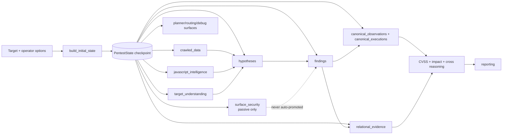
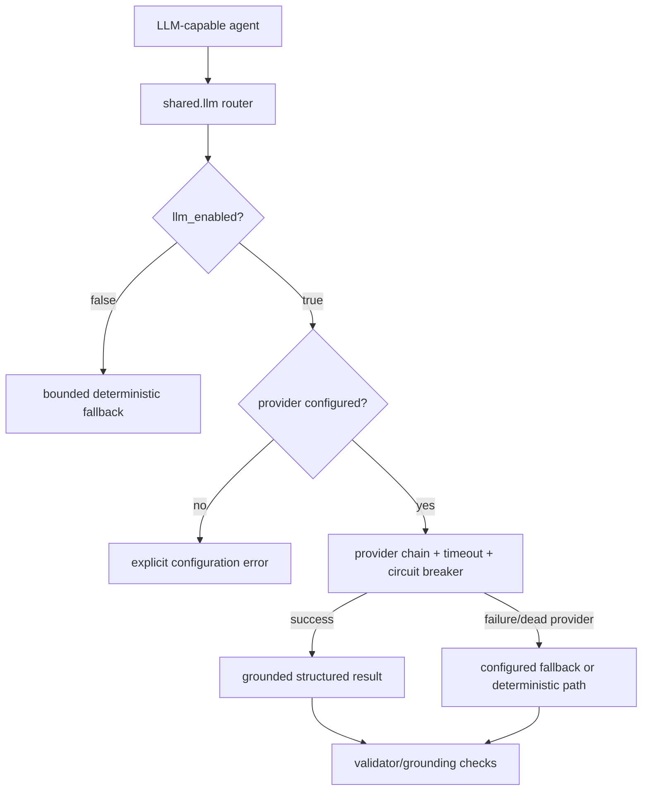

# WebPent Detailed Architecture Graph

This document is the implementation-oriented map of WebPent. It is derived from `src/webpent/graph/builder.py` and is intended for debugging, code navigation, and safe extension. `START` and `END` are LangGraph pseudo-nodes. `attack_graph` is registered only when `enable_attack_graph=true`.

## 1. Runtime and control-plane graph

```mermaid
flowchart TD
    START((START)) --> planner[planner\nengagement plan]
    planner --> auth[auth\ncredentials/session setup]

    auth -->|skip_recon=false| recon[recon\npassive discovery]
    auth -->|skip_recon=true + target_understanding=true| target_understanding[target_understanding\noptional target model]
    auth -->|skip_recon=true + target_understanding=false| hypothesis[hypothesis\nclassify attack surface]

    recon --> crawler[crawler\nURLs/forms/headers/JS]
    crawler -->|enable_js_intelligence=true| js[javascript_intelligence\nstatic source review]
    crawler -->|enable_js_intelligence=false| takeover[subdomain_takeover]
    js --> takeover
    takeover --> cloud[cloud_storage]
    cloud -->|enable_target_understanding=true| target_understanding
    cloud -->|flag off| scope[scope_enforcer]
    target_understanding --> scope
    scope --> waf[waf_detector]
    waf --> hypothesis

    hypothesis -->|findings or open hypotheses| access[access_control]
    hypothesis -->|no findings and no open hypotheses\nonly when skip_recon=true| reporter[reporter]

    access --> api[api_testing]
    api --> logic[business_logic_fuzzer]
    logic --> smuggling[request_smuggling]
    smuggling --> disclosed[disclosed_report_intel]
    disclosed -->|enable_attack_graph=true| attack[attack_graph\noptional]
    disclosed -->|flag off| strategist[strategist\npromotion checkpoint]
    attack --> strategist
    strategist --> payload[payload_generator]

    payload --> sandbox[execution_sandbox\nHITL boundary]
    sandbox --> validator[validator\ntool evidence validation]
    validator -->|retryable unconfirmed finding\nretries < 3| optimizer[payload_optimizer]
    optimizer --> sandbox
    validator -->|otherwise| devil[devils_advocate\nchallenge evidence]
    devil --> chainer[exploit_chainer\npropose relational chains]
    chainer -->|new Pending chain candidate| payload
    chainer -->|no new candidate| post[post_exploit\nbounded read-only enumeration]
    post --> rabbit[rabbit_hole\nfollow-up hypotheses]
    rabbit -->|new bounded rabbit-hole hypothesis\npolicy/counter allow| strategist
    rabbit -->|no new work or cap reached| cvss[cvss_engine]

    cvss --> impact[business_impact]
    impact --> cross[cross_reasoning\nrelational evidence synthesis]
    cross --> summary[executive_summary]
    summary --> report[reporter]
    report --> reflection[reflection\nlessons and next actions]
    reflection --> END((END))
```

## 2. Feature-flag behavior

| Feature or route | Default | When enabled | When disabled |
|---|---:|---|---|
| `skip_recon` | `false` | Bypasses recon/crawler/infrastructure path and starts from the target or target-understanding layer. | Normal discovery path runs. |
| `enable_js_intelligence` | `false` | Runs JavaScript collection and static source review after crawling. | Goes directly from crawler to infrastructure checks. |
| `enable_target_understanding` | `false` | Adds a target model before scope enforcement, and can run even after `skip_recon`. | Scope enforcement follows infrastructure checks. |
| `enable_attack_graph` | `false` | Adds the attack-graph node between disclosed-report intelligence and strategist. | Disclosed-report intelligence goes directly to strategist. |
| `enable_surface_security_analysis` | `false` | Crawler adds bounded, passive, redacted `surface_security` observations and coverage gaps. | No surface-security projection is written. |
| `llm_enabled` | configured, can be disabled | LLM router may select configured providers with fallback and circuit-breaker handling. | LLM calls fail closed and deterministic paths remain active. |
| `auto_approve` | `false` | Compiles without the execution interrupt. Use only in an explicitly authorized lab/automation context. | The graph interrupts before `execution_sandbox` for human approval. |

## 3. State/data-flow map

The shared state factory is `src/webpent/state/initial_state.py`. Both the CLI and Celery worker use it, so a checkpoint does not acquire a different schema merely because the engagement started through a different entry point. Reducer-backed collections should be treated as append/merge surfaces; do not replace them with a fresh list inside a node unless the reducer contract explicitly requires it.

## 4. LLM decision boundaries

LLM is used for bounded reasoning tasks such as planning, hypothesis prioritization, payload generation, target understanding, business impact, executive summaries, and devil's-advocate review. Deterministic components remain responsible for scope, URL normalization, redaction, feature-flag routing, evidence status, PoC policy, and final safety gates. An LLM response alone is not a confirmed Finding.

## 5. Safety boundaries

The `execution_sandbox` node is the graph's execution boundary. The default compiled graph interrupts before it. The centralized PoC policy classifies risk but does not grant permission by itself. Findings, surface observations, hypotheses, and relational edges are separate concepts; only tool-confirmed or human-reviewed evidence may support a confirmed Finding.

## 6. Where to debug

| Symptom | First place to inspect | What to compare |
|---|---|---|
| CLI and worker behave differently | `state/initial_state.py` | Factory output and entry-point overrides. |
| A node never runs | `graph/builder.py` | Node registration, conditional route, and active feature flag. |
| A finding remains pending | `validator`, `devils_advocate`, `execution_sandbox` | Evidence status, approval state, and retry counter. |
| Chained candidate does not execute | `route_after_chainer` | `tool_name=exploit_chainer`, `confidence_level=Pending`, and payload map. |
| Rabbit-hole hypothesis is ignored | `route_after_rabbit_hole` | Origin, status, loop counter, and policy cap. |
| LLM appears unexpectedly offline | `scripts/doctor.py`, `shared/llm.py` | `LLM_ENABLED`/`WEBPENT_LLM_ENABLED`, configured providers, and diagnostics. |
| Tool lookup is empty | `tools/registry.py` | `ensure_discovered()`, discovery diagnostics, and optional import warnings. |
