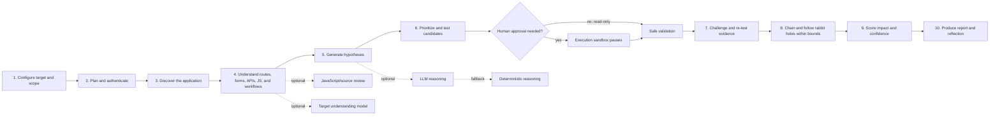

# WebPent Simple Architecture

This is the quick mental model for understanding one WebPent engagement.



## The five concepts to keep separate

| Concept | Meaning |
|---|---|
| **Surface observation** | A passive signal that a category may exist. It is useful for coverage planning but is not a vulnerability confirmation. |
| **Hypothesis** | A testable idea about a possible weakness. It may be promoted, abandoned, or left inconclusive. |
| **Evidence** | A tool result or human-reviewed observation tied to a request, response, or runtime artifact. |
| **Finding** | A reportable security result. It needs sufficient evidence and must pass validation and confidence rules. |
| **Relational evidence** | A typed link between identities, resources, requests, or findings. It helps explain BAC and chains but does not become a Finding automatically. |

## Default behavior

WebPent is target-agnostic. It does not assume DVWA, WAPTLab, a fixed route, a fixed cookie, or a fixed vulnerability count. Lab-specific credentials and session data are operator inputs. New capabilities are feature-flagged and default off so the legacy path remains predictable.

LLM usage is optional. When enabled, the shared router applies provider selection, timeouts, fallback handling, and circuit-breaker state. When disabled, the application remains usable through bounded deterministic paths. Scope enforcement, redaction, evidence status, approval policy, and final promotion are deterministic safeguards and are not delegated to the LLM.

## The shortest debugging path

```text
Target input
  -> build_initial_state()
  -> planner/auth
  -> recon/crawler (unless skip_recon)
  -> hypothesis + deep probes
  -> payload/execution/validator
  -> devils_advocate + chaining/rabbit-hole
  -> scoring/reporting/reflection
```

Start with the state and routing decision at the point where the behavior diverges. Then inspect the feature flag and the node's returned state update. Avoid debugging the final report first; most missing results originate earlier in discovery, routing, evidence, or approval.
